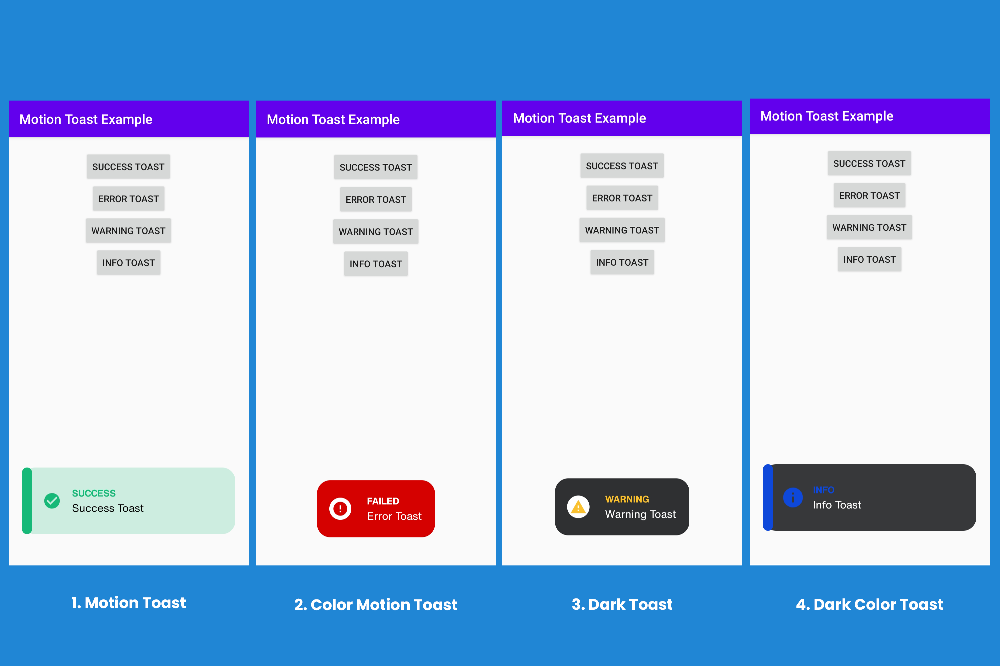

# Motion-Toast-in-Android

<h2>Output of the above code:</h2>

and for more what is motion toast, types of motion toast and how to implement it, please go to the <a href="http://gbandroidblogs.com/">GBAndroidBlogs</a>
